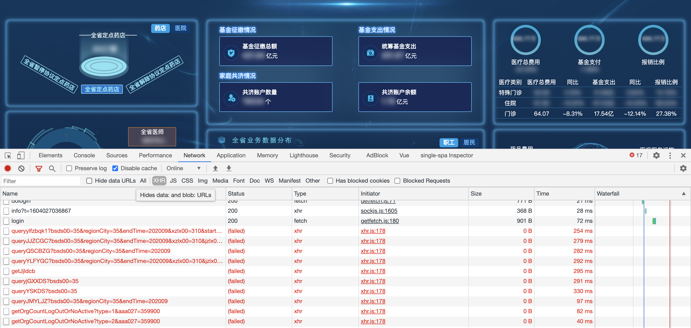
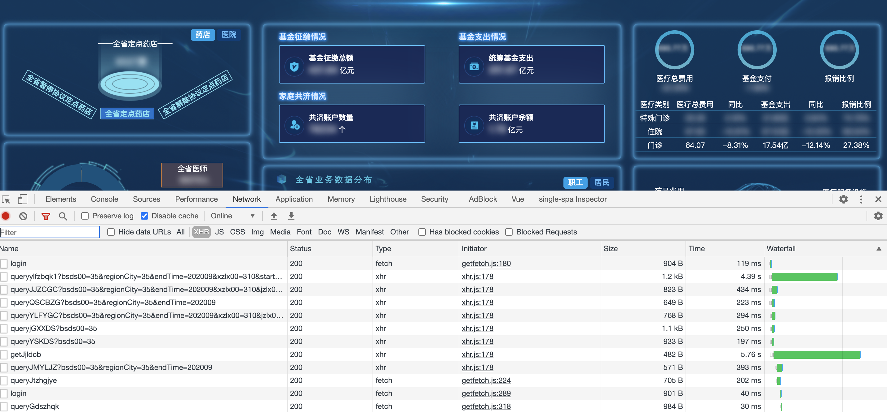
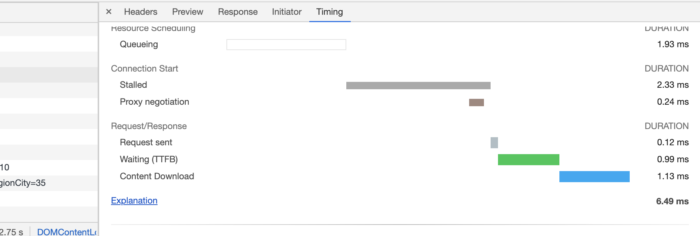

## 项目起因

不知道各位前端们在日常的开发生产中是否有过像我一样的困扰

1. 公司用的内网或特定网络，离开公司就没办法使用内部接口？
2. 大屏项目或各种向领导演示时担心网络不稳定，导致页面的数据，echart 图表等无法显示？
3. 在没有后端没有开发完的情况下怎样自己实时制造接口数据来保证自己前端开发的进度不落后？
   ..........
   其实总结就是缺少了一个我们前端可以控制的接口服务

## 看看效果

- node 服务启动前 依赖内网环境的前端项目所有的接口都无法使用
  

- node 服务启动后 在内网状态下进行缓存后即可在脱离内网环境下演示和调试页面
  

- node 服务在有缓存后可以保证向服务请求时不用等待 ⌛️ 后端数据库的查询，接口往往在 10ms 以内就可以返回，保证演示的时候界面不会出现因为等待某个接口而造成页面图表或文字显示不全
  
