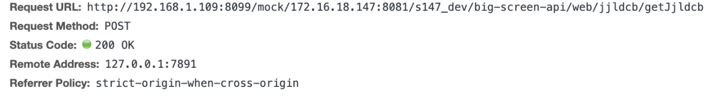
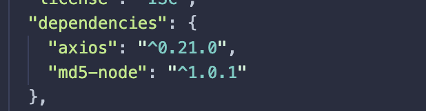
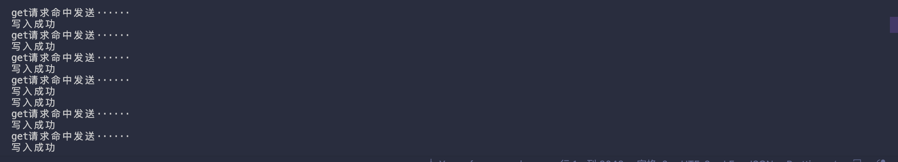
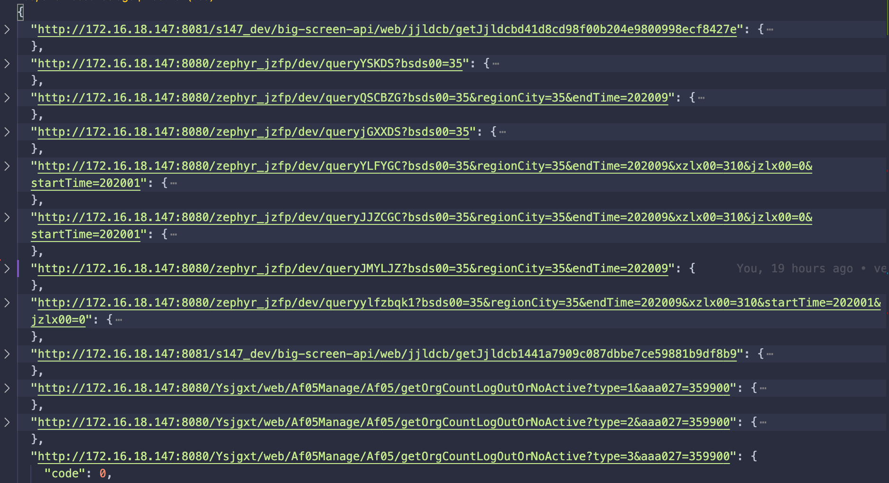
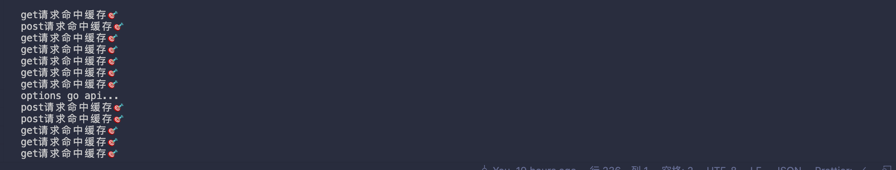

# 服务的启动和使用

1. `npm install supervisor -g`安装这个依赖可以使我们服务热更新便于调试。
   

2. 运行`npm run hot` 此时项目已经启动
3. 前端服务在原先的地址上加入此时 node 地址,例如原先前端请求地址为`172.16.18.147:8080/xxx/xxxx`则此时在前端 axios 请求配置为
   `http://node服务ip:8099/mock/172.16.18.147:8080/xxx/xxxx`
   

   此时项目会对远程地址请求 

4) 页面正常的接口请求后，所有的返回数据会保存在本地的 json 文件中
   

5) 服务开启时，如果请求命中 🎯 缓存则不会再走网络请求，而是直接获取本地 json 中的值
   
