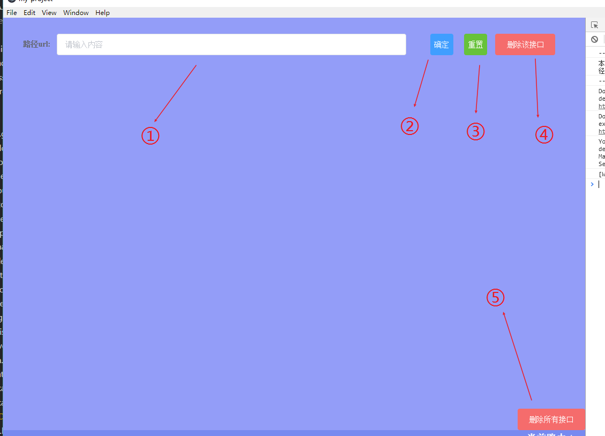
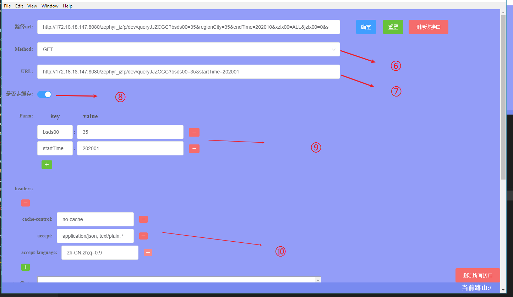
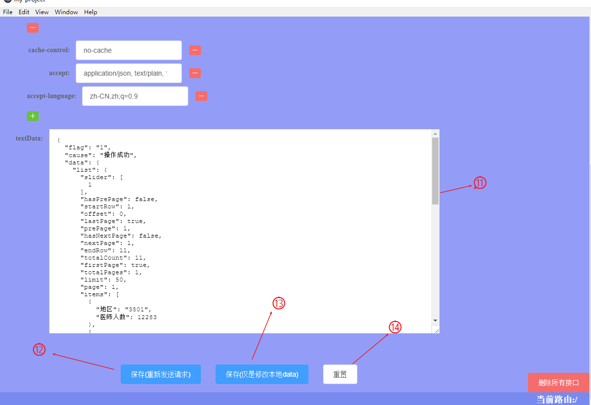

> An electron-vue project

### 项目启动

```
// 前端依赖的安装
npm install

//服务启动默认为本地3001端口
npm run dev

```

### 本地缓存文件

项目启动时会打印存储 json 所在文件夹，具体以打印地址为准。
mac 地址:`/Users/Username/Library/Application Support/Electron 下的 config.json`
windows 地址：`C:\Users\Administrator\AppData\Roaming\Electron 下的 config.json`

### mock 服务主要的目录结构

```javascript
├── src
│   ├── main                 //elecrton 主进程
│   │   ├── index.js
│   │   ├── server.js
│   │   └── store.js
│   ├── renderer             //elecrton 渲染进程
│   │   ├── App.vue
│   │   ├── components
│   │   ├── electron_store
│   │   ├── main.js
│   │   ├── router
│   │   ├── store
│   │   └── view
│   └── setting.js           //项目主要配置文件

```

### setting 配置文件内容

```javascript
const port = 3001 //项目端口号
export default {
  port,
  ip: `http://192.168.1.106:${port}/mock/`, //本地ip
  isgoel: false, //flse为不论本地json是否有数据都会请求远程服务器，若为true则在本地json有数据时取本地json作为缓存
  timeout: 500, //请求发送延迟
  elstore_time: true, //是否开启本地缓存有效时间一天:true
  Access_Headers:
    'Authorization,authorization,content-type,token,appid,appsecret,test',
  //设置Access-Control-Allow-Headers允许的请求头类型，如果要添加自定义请求头如`X-Token`,`app-token`等自定义请求头请在这里添加
  refuse_headers: [
    'host',
    'connection',
    'content-length',
    'user-agent',
    'origin',
    'referer',
    'cache-control',
    'accept-encoding',
    'pragma',
    'cookie',
    'sec-fetch-dest',
    'sec-fetch-mode',
    'sec-fetch-site'
  ],
  //这里配置的是前端不允许node服务转发修改的参数，建议不要修改

  Allowed_headers: 'GET, POST, PUT, DELETE, OPTIONS, HEAD',
  Allow_headers: 'GET, POST, PUT, DELETE, OPTIONS, HEAD'
  //这里配置的是Allowed_headers，用与配置node服务所接受的前端请求方法
}
```

### 界面的具体功能



1. url 输入框 -> 输入完整需要测试的接口路径，或输入关键字从 json 缓存文件中寻找匹配的 url 地址

2. 确定按钮 -> 点击则发送请求，根据本地 setting 配置文件，若 isgoel 不为 false，有缓存则直接返回，无存储则直接向服务端请求

3. 重置按钮 -> 点击可以重置页面接口和相关参数

4. 删除该接口按钮 -> 点击则删除该 url 对应的本地 json 所保存的相关接口内容及参数

5. 删除所有接口 -> 点击该按钮则会清空本地的 json 缓存文件



6. 请求方法选择 -> 选择要发送的请求方法

7. url ->1123

8. 是否走缓存 -> 点击后可以在服务收到请求后是否走本地接口缓存之间切换

9. parm -> 此为接口所需携带的参数，以键值对的形式进行保存，按红色`-`可以去除特定参数，绿色`+`可以添加自定义参数

10. header -> 此为接口头部所需携带的参数，以键值对的形式进行保存，按红色`-`可以去除特定参数，绿色`+`添加自定义参数后需保证在`setting.json`中`Access_Headers`有所填写的自定义参数



11. textData -> 此展示接口请求后返回给前端返回值的具体内容，可自行更改返回值后按保存按钮进行保存

12. 保存 重新发送 -> 点击则发送请求，根据页面上的请求头，携带参数等相关配置向服务器原地址请求最新的返回值，之后写入缓存中

13. 保存 修改本地 -> 只将以修改过后的 textData 的相关值对本地 json 文件进行覆盖

14. 重置按钮 -> 点击则
